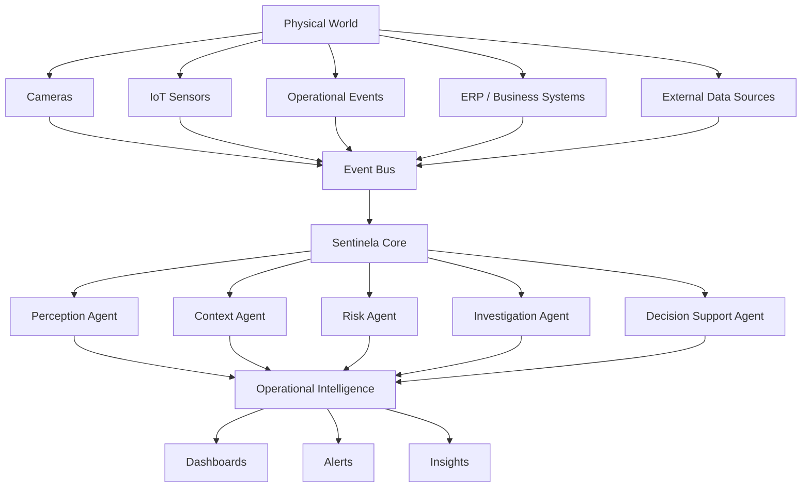

# 🚀 SentinelaOps

## AI-Powered Physical Operations Observability Platform

> **Transformando eventos do mundo físico em inteligência operacional através de IA, observabilidade e arquiteturas orientadas a eventos.**

---

# 🎯 Visão

Nas últimas décadas aprendemos a monitorar sistemas distribuídos.

Hoje conseguimos observar:

- APIs
- Bancos de dados
- Microsserviços
- Infraestrutura em nuvem
- Aplicações críticas

Mas ainda possuímos pouca visibilidade sobre:

- Operações físicas
- Ambientes industriais
- Fluxos de pessoas
- Processos operacionais
- Eventos do mundo real

O SentinelaOps nasceu para explorar uma pergunta:

> **E se aplicássemos os conceitos de observabilidade moderna ao mundo físico?**

---

# 🧠 O Que é o SentinelaOps?

SentinelaOps é uma plataforma Open Source de **Operational Intelligence** que utiliza:

- Inteligência Artificial
- Computer Vision
- Event-Driven Architecture
- Multi-Agent Systems
- Observabilidade Distribuída

para transformar eventos físicos em conhecimento operacional acionável.

---

# 🔍 O Problema

Hoje a maioria das organizações opera de forma reativa.

Um evento acontece.

Depois alguém investiga.

Depois alguém toma uma decisão.

Esse modelo gera:

- Gargalos operacionais
- Tempo de resposta elevado
- Perda de produtividade
- Fadiga operacional
- Baixa visibilidade

O SentinelaOps busca responder:

- O que está acontecendo?
- Por que está acontecendo?
- O que provavelmente acontecerá?
- O que devemos fazer agora?

---

# 🏗️ Arquitetura Conceitual

---

# 🤖 Multi-Agent Intelligence

Ao invés de uma única IA tomando decisões, o Sentinela utiliza agentes especializados.

## Perception Agent

Responsável por interpretar eventos.

Exemplos:

- Detecção de movimento
- Atividades humanas
- Veículos
- Objetos

---

## Context Agent

Adiciona contexto ao evento.

Exemplos:

- Horário
- Localização
- Histórico
- Eventos correlatos

---

## Risk Agent

Calcula criticidade.

Exemplos:

- Impacto potencial
- Severidade
- Nível de confiança

---

## Investigation Agent

Investiga eventos complexos.

Exemplos:

- Correlação temporal
- Correlação espacial
- Análise de padrões

---

## Decision Support Agent

Produz recomendações.

Exemplos:

- Priorização
- Escalonamento
- Ações sugeridas

---

# 🎥 Primeiro Domínio: Videomonitoramento

O primeiro caso de uso do projeto é:

## Redução de Falsos Positivos

Operadores recebem centenas de alertas diariamente.

Grande parte deles não representa risco real.

O SentinelaOps utiliza IA multimodal para:

- Classificar eventos
- Adicionar contexto
- Avaliar risco
- Produzir justificativas

reduzindo fadiga operacional e melhorando a tomada de decisão.

---

# 🌎 Casos de Uso Futuros

A arquitetura foi projetada para evoluir além da segurança.

## 🏭 Indústria

- Fluxos operacionais
- Paradas não planejadas
- Comportamentos anômalos

## 💊 Farmacêutico

- Comportamento operacional
- Filas
- Fluxo de clientes
- Eficiência da operação

## 🚚 Logística

- Centros de distribuição
- Movimentação de ativos
- Ocupação operacional

## 🏙 Smart Cities

- Infraestrutura urbana
- Operações municipais
- Mobilidade

## 🏥 Saúde

- Fluxos hospitalares
- Utilização de recursos
- Eficiência operacional

---

# 📈 Roadmap de Evolução

## Fase 1 — Intelligent Monitoring

- [x] Classificação de eventos
- [x] Redução de falsos positivos
- [x] Análise multimodal

## Fase 2 — Event Correlation

- [ ] Correlação temporal
- [ ] Correlação espacial
- [ ] Investigação automatizada

## Fase 3 — Operational Observability

- [ ] Métricas operacionais
- [ ] Indicadores comportamentais
- [ ] Anomalias operacionais

## Fase 4 — Digital Twin

- [ ] Representação digital da operação
- [ ] Estado operacional em tempo real
- [ ] Simulação de cenários

## Fase 5 — Predictive Intelligence

- [ ] Previsão de eventos
- [ ] Detecção antecipada de riscos
- [ ] Recomendações proativas

## Fase 6 — Autonomous Operations

- [ ] Agentes autônomos
- [ ] Orquestração de decisões
- [ ] Operações assistidas por IA

---

# 🏛️ Princípios Arquiteturais

- Domain-Driven Design (DDD)
- Clean Architecture
- SOLID
- Event-Driven Architecture
- OpenTelemetry
- Test-Driven Development
- Specification Driven Development
- AI-First Design
- Observability by Design

---

# 🔭 Visão de Longo Prazo

O objetivo do SentinelaOps não é apenas monitorar eventos.

É criar uma plataforma capaz de compreender operações.

Assim como a observabilidade revolucionou a forma como entendemos software distribuído, acreditamos que a próxima evolução será a observabilidade aplicada ao mundo físico.

---

# ⚠️ Status Atual

Projeto em fase **ALPHA**.

Atualmente focado em:

- Modelagem de domínio
- Arquitetura central
- Estratégia Multi-Agent
- Benchmarking de modelos
- Estrutura de observabilidade

### Não recomendado para produção

- ❌ Ambientes críticos
- ❌ Operações 24/7
- ❌ Tomada de decisão autônoma
- ❌ Sistemas de segurança reais

### Recomendado para

- ✅ Estudos de arquitetura
- ✅ IA Agêntica
- ✅ Computer Vision
- ✅ DDD e Clean Architecture
- ✅ Observabilidade
- ✅ Open Source Learning

---

# 🤝 Contribuindo

Contribuições são bem-vindas.

Áreas prioritárias:

- IA Agêntica
- Computer Vision
- Observabilidade
- Event Sourcing
- OpenTelemetry
- Digital Twins
- Process Intelligence

---

# 🚀 Visão Final

O SentinelaOps começou com um problema de videomonitoramento.

Mas sua visão vai além da segurança.

O objetivo é construir uma plataforma capaz de compreender ambientes, operações e processos do mundo físico utilizando Inteligência Artificial, observabilidade e arquiteturas modernas.

> O futuro não será apenas monitorado.
>
> **O futuro será compreendido.**
